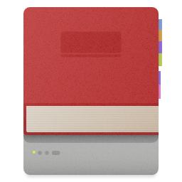

<p align="center"></p>
<h1 align="center">ReadStor - A CLI for Apple Books annotations</h1>

ReadStor is a simple CLI for exporting user-generated data from Apple Books. The
goal of this project is to facilitate data-migration from Apple Books to any
other platform. Currently Apple Books provides no simple way to do this.
Exporting is possible but not ideal and often times truncates long annotations.

Version `0.1.x` contained the core functionality: (1) save all annotations and
notes as JSON (2) render them via a custom (or the default) template using the
[Tera][tera] syntax or (3) backup the current Apple Books databases.

Note that this repository is a heavy work-in-progress and things are bound to
change.

## Usage

See the [documentation][documentation] for usage information.

## Installation

### Using Homebrew

```console
brew tap tnahs/formulas
brew install readstor
```

```console
readstor --version
```

### Using Cargo

```console
cargo install readstor
```

## Version Support

Apple Books' database schema can change with any update. The following versions
have been verified as working. This is an ever-growing list, if a version isn't
listed, it doesn't necessarily mean it isn't supported.

- macOS Ventura 13.x
  - Apple Books 5.0
- macOS Monterey 12.x
  - Apple Books 4.4
  - Apple Books 4.2
  - Apple Books 4.1
- macOS Big Sur 11.x
  - Apple Books 3.2

_Note that libraries that are synced with iCloud Drive are not supported!_

[documentation]: https://tnahs.github.io/readstor/
[tera]: https://tera.netlify.app/
