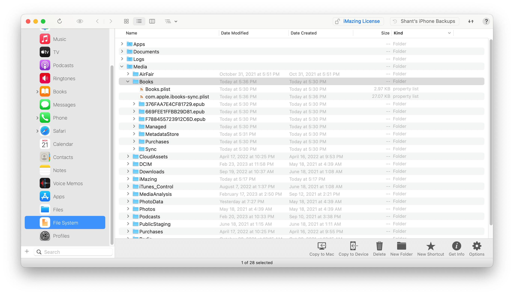

# iOS - Access Library

There are roughly two different methods for accessing iOS's Apple Books
library. A (possibly-paid) third party application or manually mounting the
device with `macFUSE` / `ifuse`.

## Access via Third-party Applications

There are a number of third-party applications that grant access to an iOS
device's filesystem. For the most part, they all expose the same directories,
however, each might differ slightly in how they are represented in the GUI.

The following is a non-exhaustive list of paid software and the library's
location within them:

### iMazing - <https://imazing.com>



### iExplorer - <https://macroplant.com/iexplorer>


## Access via `macFUSE` / `ifuse`

The free and open-source option requires a bit of work during installation but
is effortless to run once complete.

> <i class="fa fa-info-circle"></i> Note that this has only been tested on Apple
> Silicon running macOS Ventura.

### Requirements

1. Install Homebrew. See [here][homebrew] for installation instructions.

2. Install `macFUSE`. See [here][macfuse] for installation instructions
   as `macFUSE` requires enabling support for third party kernel extensions and
   will require a restart.

3. Install `ifuse`

   ```shell
   brew install gromgit/fuse/ifuse-mac
   ```

   > <i class="fa fa-info-circle"></i> Running `brew install ifuse` is broken
   > as of 2023-02-05.

### Mount the Device

First we create a mount point. This can be anywhere and named anything.

```shell
mkdir /tmp/my-device
```

#### Mount a Single Device

If only a single device is connected, it can be mounted by simply running:

```shell
ifuse /tmp/my-device
```

#### Mount Multiple Devices

If there are multiple devices connected, a specific one can be mounted using
its serial number. Assuming the device is an `iPhone`, run the following
command:

<!-- TODO: Verify this works with other devices too. -->

```shell
system_profiler SPUSBDataType -detailLevel mini | grep -e iPhone -e Serial
```

Something similar to the following will print out. The 24-character string is
the device's serial number.

```plaintext
iPhone:
  Serial Number: XXXXXXXXXXXXXXXXXXXXXXXX
  Serial Number: 000000000000
```

To convert it to a UDID add a hyphen after the eight character.

```plaintext
XXXXXXXX-XXXXXXXXXXXXXXXX
```

Finally, to mount the device, pass it to the command after the `--udid` flag to
mount it:

```shell
ifuse /tmp/my-device --udid XXXXXXXX-XXXXXXXXXXXXXXXX
```

### Troubleshooting

> `ifuse` might complain: `Invalid device UDID specified, length needs to be 40
characters`. Starting with the iPhone X, Apple changed `UDID`s to use 24 bytes
> and a dash (`-`) instead of the old 40-byte format.
>
> If you get `Failed to connect to lockdownd service on the device. Try again.
If it still fails try rebooting your device.` ensure that your device is
> connected, and isn't displaying a "Trust this computer" dialog. You'll need
> to approve that first. If you then get `ERROR: Device 000000000000000000000000
returned unhandled error code -13` you'll need to disconnect and reconnect
> the device.

<https://reincubate.com/support/how-to/mount-iphone-files/>

### Sources

- <https://github.com/RhetTbull/osxphotos/issues/745>
- <https://reincubate.com/support/how-to/mount-iphone-files/>

[homebrew]: https://brew.sh/
[macfuse]: https://github.com/macfuse/macfuse/wiki/Getting-Started
